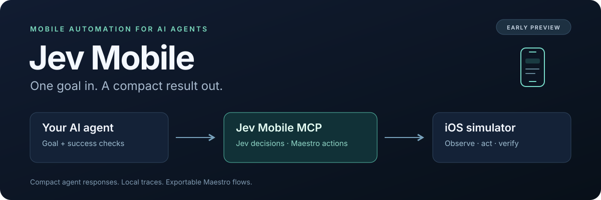

<p align="center">
  
</p>

<p align="center">
  <a href="LICENSE"></a>
  
  <a href="docs/mcp.md"></a>
  
</p>

# Jev Mobile

**Let your AI agent use your iOS simulator.**

I'm building Jev Mobile to keep mobile automation simple for AI agents. Give it a goal,
let Jev or local Laya pick the next action, and let Maestro do the tapping. Your agent gets a short
result when it's done, while the screen data and action loop stay inside the server.

The idea came from [Browser Use's jev-ultrafast](https://github.com/browser-use/jev-ultrafast).
I wanted to bring that approach to mobile apps with Maestro, and make it available as
a local MCP server.

By [Doğukaan Kılıçarslan](https://github.com/darkbringer1) · [MIT](LICENSE)

## First result: same tests, 27% fewer tokens than the Maestro MCP server

One controlled run on a real app (2026-09-25). The same Claude Haiku agent prompt did two
tasks, once with the stock Maestro MCP server and once with Jev Mobile's direct tools:

- **T1:** run an existing Maestro flow file.
- **T2:** navigate a record to a detail field and read its value.

| | Maestro MCP | Jev Mobile | Difference |
|---|---|---|---|
| T1 and T2 | both passed | both passed | — |
| Total tokens processed | 591k | **429k** | **−27%** |
| Agent turns | 13 | **10** | −3 |
| Wall time | 3.6 min | **3.2 min** | −11% |
| Screen data per read | 3.9k chars | **1.4k chars** | −64% |
| Screen reads | 4 | **2** | −2 |

Where the saving comes from: compact screens, and `run_flow` returning the screen after it runs,
so the agent reads less and makes fewer calls.

How it was run: two fresh iPhone 17 simulators (iOS 26.5) with only the app installed,
Maestro 2.10.0, one runner at a time, with the same guardrails for both. This is **one
run per runner on one app**. The direction is clear, but the numbers aren't statistically
solid yet, and repeat runs are planned. It measures the direct tools (`screen`, `run_flow`),
not the model-driven `run_goal` loop. Screens have since switched to a more compact
one-line-per-element format, which isn't reflected in these numbers.

## The idea

Your agent sends a task like:

> Open Settings, go to General, then About.

Jev Mobile reads the screen, gives the selected model a list of possible actions, runs the selected
action through Maestro, and repeats. You can supply final text checks so Maestro
verifies the result. The run also leaves behind a trace and an exported Maestro YAML flow.

The MCP interface has a few compact tools:

- **`devices`**, **`screen`**, **`screenshot`** — find a device and read what is on it.
- **`run_flow`** — run exact Maestro steps.
- **`run_goal`** — hand over a task and get a compact outcome.
- **`run_report`** — wait for a long run, or look at recent steps to debug.
- **`run_cancel`** — stop a run and its Maestro driver.

The aim is to use less of your agent's context; see the first result above. The server
runs locally. Choose TypeSafe's hosted Jev API or a local Laya model.

## Local Laya on a Mac

**On the development Mac, Laya is already installed as a background service.** From
the `jev-mobile` directory, check it and run a real inference smoke test:

```sh
uv sync --locked --extra laya
curl --fail http://127.0.0.1:8081/health
uv run --extra laya python examples/laya_smoke.py
```

The smoke test without `--device` makes local model requests and does not touch a simulator.
Expect three classification results and `"passed": true`. If the health check cannot connect,
restart the installed service, wait a few seconds, and retry:

```sh
launchctl kickstart -k "gui/$(id -u)/com.jev-mobile.laya"
```

**For a new installation**, use the foreground server below. Skip this if the health check
already succeeds; only one process can use port 8081.

Apple Silicon Macs can run the optional [Laya MLX runtime](https://github.com/mizorewww/laya-mlx)
on their GPU. No TypeSafe key is needed. The first start downloads a pinned, roughly
843 MB typed-decisions checkpoint; subsequent inference runs locally.

```sh
uv sync --locked --extra laya
uv run --extra laya jev-mobile laya-serve
```

Keep that process running. In another terminal:

```sh
curl http://127.0.0.1:8081/health
uv run --extra laya python examples/laya_smoke.py
```

To attempt the real Settings navigation test, first find a booted simulator:

```sh
uv run --extra laya jev-mobile doctor
uv run --extra laya jev-mobile devices
uv run --extra laya python examples/laya_smoke.py \
  --device YOUR_SIMULATOR_UDID --output runs/laya-ios-test
```

This opens Settings and asks Laya to navigate General → About. Inspect
`runs/laya-ios-test/smoke.json` and the nested run reports. **This mobile goal failed in
local validation**, although classification passed. The default confidence threshold is 0.5.

For MCP, use `jev-mobile serve --backend laya` or set `JEV_BACKEND=laya` in the
server environment. `LAYA_URL` / `--laya-url` can select another loopback port.
The inference endpoint binds to `127.0.0.1:8081`; it does not send your goals or
screens to TypeSafe and never falls back to a paid provider.

Laya support is experimental. Its smaller context and limited performance with large
choice sets make it different from hosted Jev. The adapter compresses screen metadata,
keeps the offered action IDs, and preserves confidence checks and independent completion
assertions. Oversized state is rejected rather than silently truncated. Passing a simple
classification check does not establish reliable mobile navigation.

See [local deployment and test notes](docs/laya.md) for service management and results.

## Use your own app

Build and install your app on a simulator using its existing project workflow. Then point
Jev Mobile at that simulator's UDID and the app's bundle identifier:

```sh
uv run --extra laya jev-mobile run --backend laya \
  --device YOUR_SIMULATOR_UDID --app-id com.example.yourapp \
  --goal 'Open the Profile screen' --expect-text 'Profile' \
  --max-steps 5 --output runs/my-app-profile
```

Replace the example goal and final text with something in your app. Only `verified` means
the supplied checks passed. This controller uses your existing app build and Maestro;
it does not replace the app's build system or existing deterministic test suite.

Follow [the app integration guide](docs/your-app.md) for device/app discovery, text fields,
MCP configuration, and debugging. An agent continuing this work should start with
[the handoff notes](docs/handoff.md).

## Hosted Jev setup (optional)

You'll need Python 3.11+, [uv](https://docs.astral.sh/uv/), Xcode, a booted iOS simulator,
and [Maestro](https://github.com/mobile-dev-inc/maestro) with MCP support. The tested
Maestro build is 2.10.0 and supports `maestro mcp --no-viewer`.

From your checkout:

```sh
uv sync --locked
uv run jev-mobile doctor
uv run jev-mobile devices
cp .env.example .env
```

Add your [TypeSafe API key](https://docs.typesafe.ai/) to `.env`:

```dotenv
TYPESAFE_API_KEY=your-key-here
```

For a first task, open Settings on an English-language simulator and try:

```sh
uv run --env-file .env jev-mobile run \
  --device YOUR_SIMULATOR_UDID \
  --app-id com.apple.Preferences \
  --goal 'Open General, then About' \
  --expect-text 'About' \
  --expect-text 'iOS Version'
```

This is a suggested task to try; the live Jev demo is still on the todo list.
Device discovery and the offline tests work without an API key.

## Use it with your agent

Three commands from this checkout (run `make` to see every target):

```sh
make install                                        # checks prerequisites, installs the
                                                    # jev-mobile command and the Laya service,
                                                    # and registers the MCP server user-wide
make apps                                           # bundle IDs on booted simulators
make connect APP=com.example.yourapp PROJECT=~/code/your-app   # optional per-app default
```

`make install` ends with `make register`, which runs `jev-mobile setup --global`, so every
project sees the tools. It discovers each Claude Code config (`~/.claude.json` plus
`~/.claude-*` profiles used with `CLAUDE_CONFIG_DIR`) and asks before registering in each;
`YES=1` (or `--yes`) registers in all of them without asking.

`make check` lists anything missing with the command to install it. `make doctor` checks
Laya and Maestro afterwards. Without make, the equivalent is `uv tool install --editable .`
and then `jev-mobile setup --app-id com.example.yourapp` inside your app repository.

`setup` registers the server with every detected client: Claude Code (this project's
local scope, in each discovered config), Codex (`~/.codex/config.toml`, with a 10-minute tool timeout), and Cursor
(`.cursor/mcp.json`). Use `--client` to pick one, `--global` for user-wide Claude/Cursor
config, `--device` to pin a simulator, and `--client json` to print a config for other clients.
It defaults to the local Laya backend. The server exposes direct Maestro tools too
(`screen`, `screenshot`, `run_flow`), so it replaces a separate Maestro MCP server.

For a manual configuration, use [the Laya MCP config](examples/mcp-laya.json) for local inference, or
[the Jev MCP config](examples/mcp.json) for the hosted API. Replace the paths, simulator ID,
and app ID with your own. Your client starts the Jev Mobile MCP process; the Laya inference
service must already be running separately.

The local launch command is:

```sh
uv run --extra laya jev-mobile serve --backend laya \
  --device YOUR_SIMULATOR_UDID \
  --app-id com.apple.Preferences
```

With the device and app configured, a `run_goal` call looks like this:

```json
{
  "goal": "Open General, then About",
  "expect_text": ["About", "iOS Version"]
}
```

Only `verified` means the checks you supplied passed. If you leave out `expect_text`,
the run can finish as `done_unverified`.

The server has no per-goal deadline by default (`--timeout` sets one), so long flows
that wait on network calls finish; make sure your client's tool timeout is long too. More options are in the [MCP guide](docs/mcp.md).

## A couple of useful bits

**Text fields:** pass `values` in an MCP call, or `--values examples/values.json` in
the CLI. It's a map of field IDs to the text you want entered:

```json
{"search_field": "Coffee"}
```

You'll need to know the field's accessibility/resource ID. The model chooses which field
to fill; free-form text generation isn't implemented yet.

**Saved runs:** CLI output goes to `runs/latest/`. MCP output goes to
`~/Library/Application Support/jev-mobile/runs/<run-id>/` (override with `--output` or `JEV_RUNS`). Completed CLI loops save their steps, a result summary, and `flow.yaml`;
an early CLI exception may leave only a partial trace. MCP goal errors also save a result report.
You can replay a CLI export with:

```sh
maestro test runs/latest/flow.yaml
```

You may need to adjust the starting state or add waits before reusing an exported flow.

## Still early

The local MCP connection works, the offline tests pass, and the scripted iOS check
navigates Settings → General → About. Live Jev runs and Android testing are next.
Local Laya classification works, but its tested Settings goal did not complete. A separate
full MCP goal timed out waiting for Maestro. There are no comparative speed or cost benchmarks.

Right now this works with UI elements Maestro can identify. Unlabelled controls,
custom-drawn screens, complex gestures, and ambiguous targets still need work.
For the details, see the [validation notes](docs/validation.md).

Live runs using the Jev backend send screen element data, your goal, and supplied field values
to TypeSafe. The Laya backend sends them only to the configured loopback server.
Traces and exported flows can contain entered text. `.env` and `runs/` are ignored by
Git; use demo data when sharing a recording.

## Hack on it

```sh
uv sync --locked --extra laya
uv run --extra laya pytest
uv run --extra laya ruff check .
uv build
```

Check the local MCP connection without paid calls or device actions:

```sh
uv run python examples/check_mcp.py
```

Try the scripted Settings check without a Jev key:

```sh
uv run python examples/ios_settings_smoke.py --device YOUR_SIMULATOR_UDID
```

I'd welcome help with a live demo, better text input, Android support, and measuring
how much agent context this saves. See [CONTRIBUTING.md](CONTRIBUTING.md).

## Thanks

Built with [Maestro](https://github.com/mobile-dev-inc/maestro) and
[TypeSafe Jev](https://docs.typesafe.ai/). Thanks to the Browser Use team for sharing
[jev-ultrafast](https://github.com/browser-use/jev-ultrafast), which inspired this project.

This is my independent project, not an official project from those teams.
[MIT license](LICENSE) · [Third-party notices](THIRD_PARTY_NOTICES.md)
